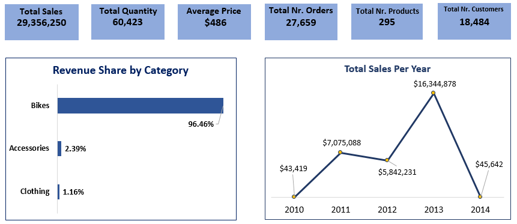
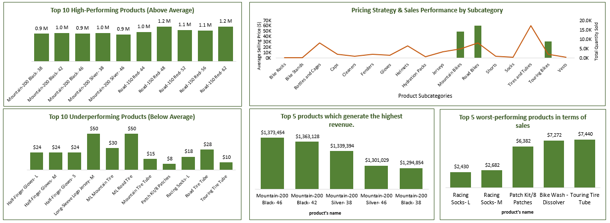
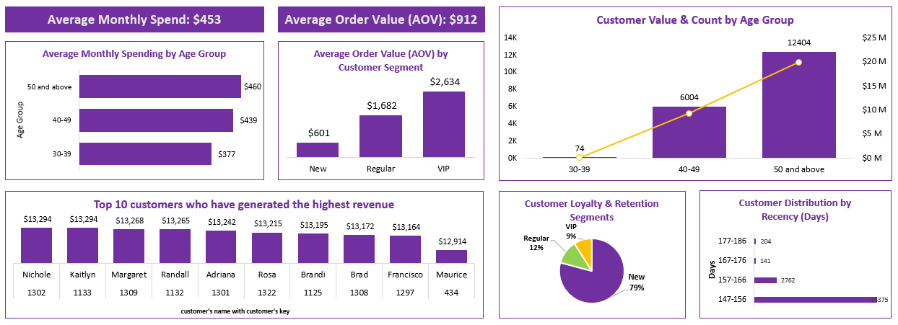
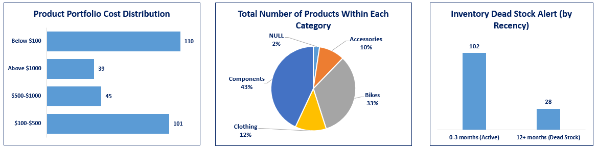
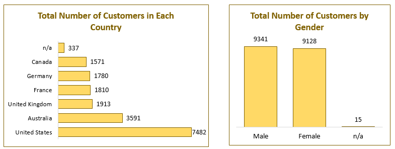
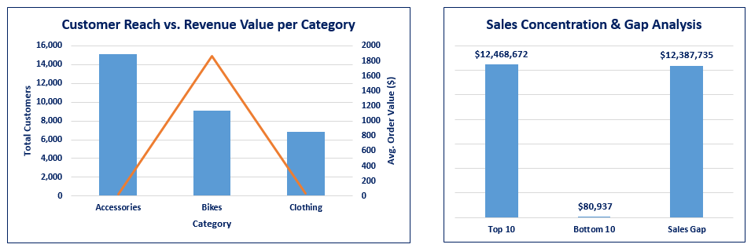

# 📊 Dashboard Insights — Sales Data Warehouse & Analytics Pipeline

A summary of key findings, business implications, and recommendations from each dashboard. All insights are backed by verified SQL queries and cross-validated against source data.

---

## 1️⃣ Executive Dashboard — Business Overview & Sales Trends

  

### 📌 Key Metrics
| KPI | Value |
|-----|-------|
| 💰 Total Sales | $29.35M |
| 📦 Total Units Sold | 60,423 |
| 💵 Avg. Selling Price | $486 |
| 🛒 Total Orders | 27,659 |
| 👥 Total Customers | 18,484 |
| 🏷️ Total Products | 295 |

---

### 🔍 Finding 1 — Bikes Dominate Revenue at 96.46%
Nearly all revenue comes from a single category.

| Category | Revenue Share |
|----------|--------------|
| 🚲 Bikes | 96.46% |
| 🎒 Accessories | 2.39% |
| 👕 Clothing | 1.16% |

**💡 What It Means:** The business is almost entirely dependent on bike sales. Any downturn in bike demand — seasonal, competitive, or economic — hits total revenue directly, with no other category large enough to absorb the impact.

**✅ Recommendation:** Introduce point-of-sale bundling (e.g., helmet + gloves with every bike purchase) to grow accessory revenue without needing new customers.

---

### 🔍 Finding 2 — Strong Growth Through 2013, Then a Cliff in 2014
| Year | Sales |
|------|-------|
| 2010 | $43K |
| 2011 | $7.07M |
| 2012 | $5.84M |
| 2013 | $16.34M ⭐ Peak |
| 2014 | $45.6K ⚠️ |

**💡 What It Means:** 2013 was the business's best year — over half of all recorded revenue came from a single year. The 2014 drop is not yet confirmed as a real business event or an incomplete data extract.

**✅ Recommendation:** Verify 2014 data completeness before drawing conclusions. If confirmed real, investigate root causes immediately (stock-outs, supplier issues, market exit).

---

### 🔍 Finding 3 — Moderate Repeat Purchase Rate
27,659 orders from 18,484 customers = ~1.5 orders per customer on average.

**💡 What It Means:** Most customers buy once or occasionally — the business is likely over-reliant on new customer acquisition rather than growing existing relationships.

**✅ Recommendation:** Invest in post-purchase engagement (maintenance reminders, seasonal check-ins, accessory recommendations) to convert one-time buyers into repeat customers.

---

## 2️⃣ Sales & Product Performance — Revenue, Pricing & Portfolio

  

### 🔍 Finding 1 — Mountain-200 is the Revenue Engine
The top 5 revenue-generating products are all **Mountain-200 variants**, together contributing **$6.67M**.

| Top 5 Products | Revenue |
|---------------|---------|
| Mountain-200 Black-46 | $1.37M |
| Mountain-200 Black-42 | $1.36M |
| Mountain-200 Silver-38 | $1.34M |
| Mountain-200 Silver-46 | $1.30M |
| Mountain-200 Black-38 | $1.29M |

**💡 What It Means:** A single product line is carrying a disproportionate share of the business. A stock-out or quality issue in any of these variants would directly impact total revenue.

**✅ Recommendation:** Treat Mountain-200 variants as protected SKUs — maintain safety stock and prioritize supplier relationships specifically for this line.

---

### 🔍 Finding 2 — Two Different Business Models Running in Parallel
| Product Type | Avg. Price | Sales Volume |
|-------------|-----------|-------------|
| 🚲 Mountain/Road/Touring Bikes | High ($500–$3,500) | Low |
| 🔧 Tires, Tubes, Bottles, Cages | Very Low ($2–$10) | Very High |

**💡 What It Means:** Bikes earn through high margin per unit. Accessories earn through volume and repeat purchases. Treating them with the same pricing or marketing strategy is a mistake — they serve fundamentally different roles.

**✅ Recommendation:** Use low-cost, high-volume accessories as **loss-leaders** (bundled with bike purchases at a discount). Reserve price-increase experiments for moderately priced, high-demand items like Helmets (+5–10%).

---

### 🔍 Finding 3 — A Long Tail of Low-Impact Products
| Worst Performers | Total Revenue |
|-----------------|--------------|
| Racing Socks-L | $2,430 |
| Racing Socks-M | $2,682 |
| Patch Kit/8 Patches | $6,382 |
| Bike Wash - Dissolver | $7,272 |
| Touring Tire Tube | $7,440 |

**💡 What It Means:** These products likely cost more to stock and market than they return. They're creating inventory and attention overhead without meaningful business value.

**✅ Recommendation:** Cut active marketing spend on these items. Reposition them as **free-gift-with-purchase bundles** on bike sales to clear stock while adding perceived value.

---

## 3️⃣ Customer Insights — Spend, Loyalty & Segmentation

  

### 📌 Key Metrics
| KPI | Value |
|-----|-------|
| 📅 Avg. Monthly Spend | $453 |
| 🛒 Avg. Order Value (AOV) | $912 |

---

### 🔍 Finding 1 — VIP Customers Spend 4.4x More Per Order
| Segment | AOV | Share of Customers |
|---------|-----|--------------------|
| 🆕 New | $601 | 79% |
| 🔁 Regular | $1,682 | 12% |
| ⭐ VIP | $2,634 | 9% |

**💡 What It Means:** 79% of customers are at the lowest AOV tier. Even converting a small fraction of "New" to "Regular" would have a substantial revenue impact given the segment's size.

**✅ Recommendation:** Build a structured loyalty progression path targeting the New segment specifically — this is where the largest untapped revenue opportunity lies, not in further upselling the already-small VIP base.

---

### 🔍 Finding 2 — Spend Rises with Age, But Verify Before Acting ⚠️
| Age Group | Avg. Monthly Spend | Customer Count |
|-----------|-------------------|----------------|
| 30–39 | $377 | 74 |
| 40–49 | $439 | 6,004 |
| 50+ | $460 | 12,404 |

**💡 What It Means:** On the surface, older customers appear to dominate both headcount and spending. However, this aligns with a known data quality issue — no customers are recorded below age 40, and the maximum recorded age is 110. This could be a data artifact rather than a real demographic signal.

**⚠️ Caveat:** Validate the birthdate field before using this for targeting decisions. Treat this as a hypothesis, not a confirmed insight.

**✅ Recommendation:** If confirmed accurate, prioritize marketing and product positioning toward the 40+ demographic. If not, fix the birthdate data first.

---

### 🔍 Finding 3 — Top Customers are Tightly Clustered, No Dominant Account
Top 10 customers each generated **$12,914–$13,294** in revenue — no single customer dominates.

**💡 What It Means:** Revenue isn't dangerously concentrated in one or two accounts. Losing any single top customer wouldn't be catastrophic.

**✅ Recommendation:** Maintain light account management for this group (personalized offers, dedicated support) to protect these relationships without over-investing.

---

### 🔍 Finding 4 — 2,762 Customers Are in the At-Risk Recency Window
| Recency Band | Customers |
|-------------|-----------|
| 147–156 days | 375 |
| **157–166 days** | **2,762** ⚠️ |
| 167–176 days | 141 |
| 177–186 days | 204 |

**💡 What It Means:** The 157–166 day group is the largest at-risk cluster — approaching dormancy. This is the most actionable retention opportunity in the dataset.

**✅ Recommendation:** Launch a targeted re-engagement campaign (email/promotion) specifically for this recency band before they lapse further.

---

## 4️⃣ Product & Inventory — Catalog Composition & Dead Stock

  

### 🔍 Finding 1 — Long Tail, Short Head Cost Structure
| Price Range | Product Count |
|------------|--------------|
| Below $100 | 110 |
| $100–$500 | 101 |
| $500–$1,000 | 45 |
| Above $1,000 | 39 |

**💡 What It Means:** 71% of products are priced under $500, but revenue is driven by the 28% priced above $500. Most SKUs contribute little individually — a handful carry the business.

**✅ Recommendation:** Prioritize catalog management effort (supplier negotiation, quality control, marketing spend) on the above-$500 segment first.

---

### 🔍 Finding 2 — 2% of Products Have No Category ⚠️
| Category | Share |
|----------|-------|
| Components | 43% |
| Bikes | 33% |
| Clothing | 12% |
| Accessories | 10% |
| ❓ NULL | 2% |

**💡 What It Means:** ~6 products are invisible to category-level reporting and analysis. They'll be silently excluded from any category-based filtering or segmentation.

**✅ Recommendation:** Investigate the NULL-category products at the source (`prd_info.csv` or ERP category mapping) and assign a correct category or flag them as "Uncategorized."

---

### 🔍 Finding 3 — Bimodal Dead Stock Pattern: Active or Gone, Nothing In Between
| Inventory Status | Product Count |
|-----------------|--------------|
| ✅ Active (0–3 months) | 102 (78%) |
| ⛔ Dead Stock (12+ months) | 28 (22%) |
| 4–6 months | 0 |
| 7–12 months | 0 |

**💡 What It Means:** The clean split with no middle ground suggests this isn't organic slowdown — it's a **planned product-line discontinuation**. The 28 dead-stock items are likely older-generation models (e.g., Mountain-100, Road-150 series, last sold in 2011) replaced by newer lines (Mountain-200, Road-250). This is actually a healthy sign — it reflects lifecycle management, not demand collapse.

**✅ Recommendation:** Confirm discontinuation status with inventory records. Prioritize clearing remaining stock via clearance pricing or bundling rather than holding indefinitely.

---

## 5️⃣ Geo & Demographics — Geographic & Gender Distribution

  

### 🔍 Finding 1 — US + Australia = ~60% of All Customers
| Country | Customers | Share |
|---------|-----------|-------|
| 🇺🇸 United States | 7,482 | 40.5% |
| 🇦🇺 Australia | 3,591 | 19.4% |
| 🇬🇧 United Kingdom | 1,913 | 10.4% |
| 🇫🇷 France | 1,810 | 9.8% |
| 🇩🇪 Germany | 1,780 | 9.6% |
| 🇨🇦 Canada | 1,571 | 8.5% |
| ❓ Unclassified | 337 | 1.8% |

**💡 What It Means:** This is primarily a US/Australia business with a modest European footprint. The four European markets are each small and similarly sized — suggesting emerging opportunity rather than an established presence. Overdependence on the US (40%+) means US market conditions have outsized influence on the whole business.

**✅ Recommendation:** Before expanding in Europe, evaluate whether the even split across UK/France/Germany/Canada reflects genuine demand or limited marketing reach. That determines whether to go deep in one market or stay broad.

---

### 🔍 Finding 2 — Gender Distribution is Nearly Equal
| Gender | Customers | Share |
|--------|-----------|-------|
| 👨 Male | 9,341 | 50.6% |
| 👩 Female | 9,128 | 49.4% |
| ❓ n/a | 15 | 0.08% |

**💡 What It Means:** Gender isn't a meaningful broad segmentation axis for this business. Neither gender dominates strongly enough to justify separate mass-marketing strategies.

**✅ Recommendation:** Reserve gender-specific campaigns for product-level fit only (e.g., women's apparel lines) rather than treating gender as a primary segmentation lever.

---

### 🔍 Finding 3 — Small but Notable Data Quality Gaps
- **337 customers (1.8%)** have no recorded country
- **15 customers (0.08%)** have no recorded gender

**💡 What It Means:** Likely a CRM-ERP join coverage issue — some customers exist in one system but not the other. Small in count, but these records will be silently dropped from geographic and demographic analysis.

**✅ Recommendation:** Investigate the join logic and either backfill from another source or flag as "Unknown" explicitly.

---

## 6️⃣ Cross Analysis — Category Economics & Revenue Concentration

  

### 🔍 Finding 1 — Two Parallel Business Models in One Company
| Category | Total Customers | Avg. Order Value |
|----------|----------------|-----------------|
| 🎒 Accessories | 15,114 | $19 |
| 🚲 Bikes | 9,132 | $1,862 |
| 👕 Clothing | 6,852 | $37 |

**💡 What It Means:** Accessories reach the most customers but generate almost no per-transaction revenue. Bikes reach fewer customers but generate ~100x more per order. These categories shouldn't be evaluated by the same metric — they serve different business functions.

**✅ Recommendation:** Measure Accessories and Clothing by their role in customer acquisition and future bike purchase conversion, not standalone revenue. A customer who first buys a helmet might eventually buy a bike.

---

### 🔍 Finding 2 — 154x Revenue Gap Between Top and Bottom Products
| Group | Total Sales |
|-------|------------|
| 🏆 Top 10 Products | $12,468,672 |
| 📉 Bottom 10 Products | $80,937 |
| 📊 Sales Gap | $12,387,735 |

**Top 10 products outsell the bottom 10 by 154x.**

**💡 What It Means:** Revenue concentration is extreme. A small group of Mountain-200 and Road-150 variants effectively *are* the business. This isn't unusual for retail, but it means inventory, marketing, and supply chain decisions should never treat all 295 SKUs as equally important.

**✅ Recommendation:** Formalize an ABC-style product classification — weight resources toward top revenue-driving SKUs rather than spreading effort evenly across the full catalog.
