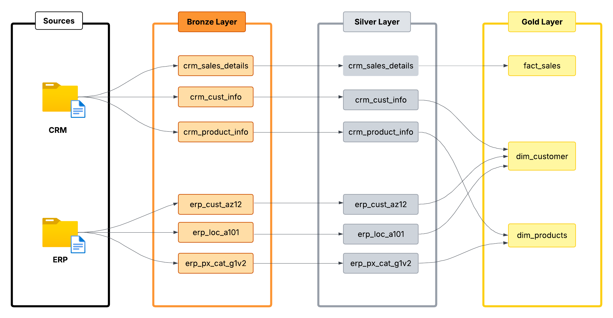

# ⚙️ Data Engineering — Architecture & ETL Process

## 🗺️ Data Flow Architecture

Below is the architectural representation of the data pipeline, following the Medallion Architecture (Bronze, Silver, and Gold layers).

  

To ensure data reliability and quality, I implemented a **Medallion Architecture**, organizing data into three distinct layers:

* **🥉 Bronze (Raw Layer):** Acts as the landing zone for raw source files. The data is kept in its original format to maintain a complete history (data lineage) and allow for reprocessing if needed.
* **🥈 Silver (Curated Layer):** The "Cleaning" zone. In this layer, data from CRM and ERP is merged, cleaned, and standardized. Duplicates are removed, and inconsistent formats are resolved to create a single version of truth.
* **🥇 Gold (Analytical Layer):** The "Business-Ready" zone. Data is modeled into **Fact** and **Dimension** tables (Star Schema), optimized for high-speed analytical queries and dashboarding.

---

## 🚀 ETL Process Details

I developed a comprehensive ETL pipeline to ensure the raw data is transformed into a high-quality analytical asset.

### 1. Extraction (Source Ingestion)
* **Extraction Method:** Implemented a **Pull Extraction** strategy.
* **Extraction Type:** **Full Extraction** of source datasets.
* **Techniques:** Utilized **File Parsing** to ingest raw CSV data into the staging environment.

### 2. Transformation (Data Refining)
Data was cleaned and enriched using advanced SQL techniques to ensure it was "analytics-ready":

* **Data Cleansing:**
    * Performed **Data Type Casting** for schema consistency.
    * Removed duplicates and applied **Data Filtering** to eliminate noise.
    * Handled missing data (NULLs), invalid values, and unwanted white spaces.
    * Resolved invalid `sales` values (NULL, zero/negative, or mismatched against `quantity × price`) by recalculating `sales = quantity × ABS(price)`; applied a complementary fix to recover zero/negative `price` values by back-calculating from `sales ÷ quantity`.
* **Data Integration & Enrichment:**
    * Unified disparate data from multiple sources (CRM + ERP).
    * Created **Derived Columns** and implemented **Business Rules & Logic**.
    * Applied **Normalization and Standardization** for unified naming conventions.
    * Performed **Data Aggregations** to pre-calculate key metrics.

### 3. Load (Data Warehousing)
* **Processing Type:** Optimized for **Batch Processing**.
* **Load Methods:** Implemented various strategies including **Full Load** (Truncate & Insert, Drop & Create) and **Upsert** for incremental updates.
* **Slowly Changing Dimensions (SCD):** Applied **SCD Type 1** logic to maintain the most current state of Dimension tables (Customers/Products) without keeping historical changes.
