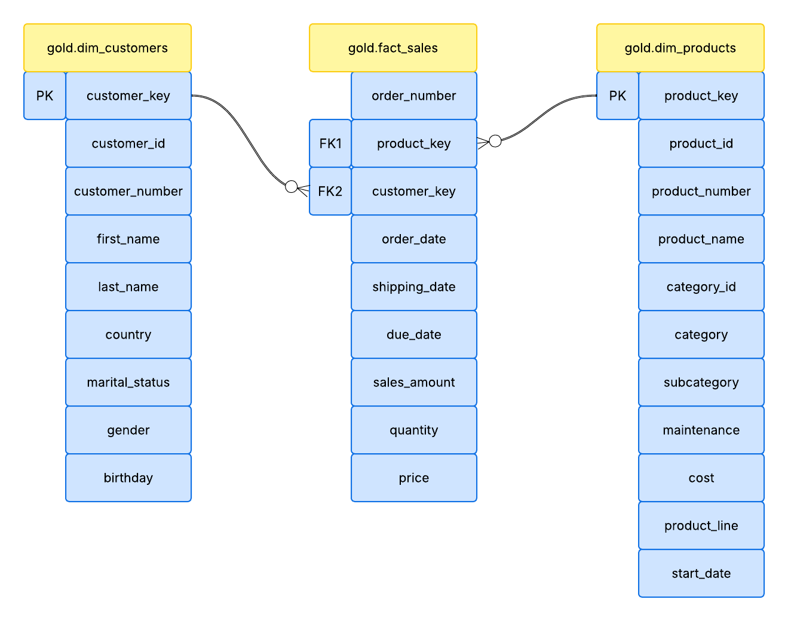

# Sales Data Warehouse and Analytics Pipeline

This project builds a complete SQL Server data warehouse using the **Medallion Architecture**, transforming **6 fragmented CRM/ERP source files** (75,000+ raw records) into a clean, analytics-ready Star Schema. Using that warehouse, I analyzed **$29.35M in revenue across 18,484 customers** to uncover concrete business insights — from a near-total revenue dependency on two bike product lines, to a bimodal dead-stock pattern signaling planned product discontinuation — each backed by a specific, actionable recommendation.

---

## 🎯 Objectives

### ⚙️ Data Engineering
* Designed and built a SQL Server data warehouse following the **Medallion Architecture** (Bronze → Silver → Gold)
* Ingested and consolidated fragmented data from separate **CRM** and **ERP** source systems into a single, unified structure
* Cleaned, standardized, and validated raw data — handling duplicates, missing values, and inconsistent formats — to ensure analytics-ready data quality
* Modeled the final Gold layer into a **Star Schema** (Fact + Dimension tables) optimized for fast analytical querying

### 📊 Data Analytics
* **Sales Performance:** Identified revenue trends, seasonal patterns, and year-over-year growth/decline
* **Customer Segmentation:** Categorized customers by behavior and value (e.g., new vs. repeat, VIP vs. regular) to understand spending drivers
* **Product Performance:** Ranked products and categories by revenue contribution to separate high-impact items from low-impact ones
* **Inventory Insight:** Flagged slow-moving and dead stock by cross-referencing sales activity with product catalog data
* **Business Reporting:** Translated SQL-derived metrics into Excel dashboards to support data-driven decision-making

---

## 🛠️ Tech Stack & Tools

### Tools & Technologies
* 🗄️ **Database & Warehousing:** SQL Server (T-SQL)
* 🔄 **Data Transformation:** SQL (Views, Joins, Aggregations, CTE, Window Functions)
* ✅ **Data Quality & Testing:** SQL-based validation scripts for Silver & Gold layer integrity checks
* 📊 **Business Intelligence & Reporting:** Microsoft Excel
* 🌿 **Version Control:** Git & GitHub

### Core Concepts Applied
Data Warehousing (Medallion Architecture), Exploratory Data Analysis (EDA), KPI Development, ETL (Extract, Transform, Load)

---

## 📂 Data Source

This project works with six raw source files simulating a real-world retail business's **CRM** and **ERP** systems (provided by my mentor as part of a structured learning exercise). The files arrive fragmented, inconsistent, and unprocessed — mirroring the kind of messy, multi-source data analysts typically encounter on the job. Combined, the files span over **75,000 records** and cover sales transactions from **2010 to 2014**. From this starting point, I designed and built the entire pipeline: schema design, cleaning logic, transformation rules, and the resulting business analysis are all my own work.

### 📱 CRM System Files:
* `cust_info.csv` *(15,000+ rows)*: Customer master data — ID, name, marital status, gender, and account creation date.
* `prd_info.csv` *(350+ rows)*: Product catalog — ID, product key, name, cost, product line, and active date range (start/end).
* `sales_details.csv` *(60,000+ rows)*: Transaction-level sales records — order/ship/due dates, customer and product keys, quantity, price, and sales amount.

### 🏢 ERP System Files:
* `CUST_AZ12.csv` *(18,000+ rows)*: Supplementary customer data — birthdate and gender, used to cross-validate and enrich CRM customer records.
* `LOC_A101.csv` *(18,000+ rows)*: Customer-to-country mapping for geographic analysis.
* `PX_CAT_G1V2.csv` *(38 rows)*: Product category, subcategory, and a maintenance flag (Yes/No) reference table.

---

## 📁 Project Structure

The repository is organized as follows:

```text
End-to-End Sales Data Warehouse and Analytics Pipeline/
├── 01_raw_datasets/
│   ├── source_crm/
│   └── source_erp/
├── 02_sql/
│   ├── 01_build_warehouse/
│   ├── 02_Analysis/
│   └── 03_verification/
├── 03_dashboard_images/
├── 04_assets/
├── README.md
├── LICENSE
```
---

## ⚙️ Data Engineering

The pipeline follows the **Medallion Architecture** (Bronze → Silver → Gold), with a full ETL process covering source ingestion, data cleaning, transformation, and Star Schema modeling.

📄 [View Data Engineering Details →](07_data_engineering.md)

---

### 🗺️ Schema Diagram
Below is the Entity Relationship Diagram (ERD) representing the data warehouse structure:

<p align="center">
  
</p>

### Data Model Structure:
* **Fact Table (`gold.fact_sales`):** Stores business metrics like `sales_amount`, `quantity`, and `price`, linked via foreign keys to dimensions.
* **Dimension Tables:**
    * **`gold.dim_customers`:** A unified master record for customers, including demographics like country, marital status, and gender.
    * **`gold.dim_products`:** A centralized product catalog with attributes like category, product line, and cost.

### Relationships:
The model utilizes a **One-to-Many (1:M)** relationship, ensuring high-speed joins and an intuitive structure for dashboarding in Excel.

---

## 🔍 Exploratory Data Analysis (EDA)

A deep dive into the Gold layer to validate data integrity, understand business footprint, and audit data quality — covering sales metrics, product catalog composition, and customer demographics.

📄 [View Full EDA →](06_EDA.md)

---

## 📊 Dashboards & Business Insights

Six interactive Excel dashboards translate SQL-derived metrics into business-ready visuals — covering sales trends, product performance, customer segmentation, inventory health, geographic distribution, and cross-category analysis.

📄 [View Full Dashboard Snapshots and Insights →](05_DASHBOARD_FINDINGS.md)

---

## 📌 Conclusion
This project built a complete SQL Server data warehouse using the Medallion Architecture, transforming **6 fragmented CRM/ERP source files** into a clean, analytics-ready Star Schema — and used it to uncover real business insight from **$29.35M in revenue** across **18,484 customers**. Key findings include a near-total revenue dependency on the Mountain-200/Road-150 bike lines (top 10 products outselling the bottom 10 by ~154x), a customer base concentrated in the 50+ age group (flagged for data-quality verification), and a clear "reach vs. revenue" split between accessories and bikes. Along the way, the project surfaced and corrected several real data-quality issues, reflecting the kind of careful validation a production analytics pipeline requires.

---

## 📬 Contact
* **Author:** Maksuda Akter
* **E-mail:** suborno200139@gmail.com
